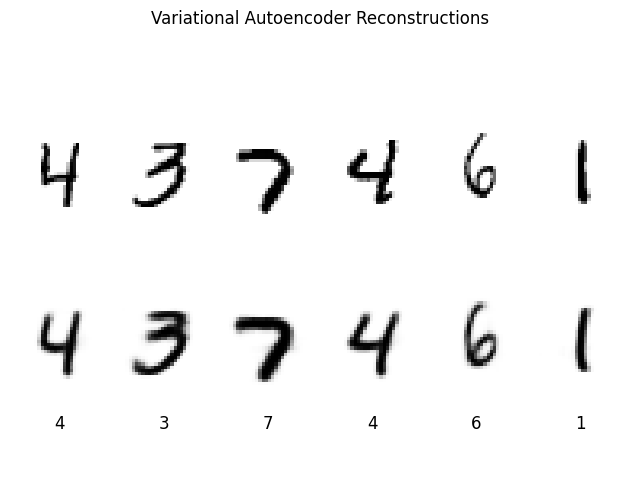

# Variantional Autoencoder

VAE trained on the MNIST dataset - creates a latent representation of the images which
is then used to reconstruct them. Example (top is inputs, bottom is outputs):

Uses a custom loss function which is a parameterised combination of the Binary Cross
Entropy loss and the Kullback–Leibler divergence.
